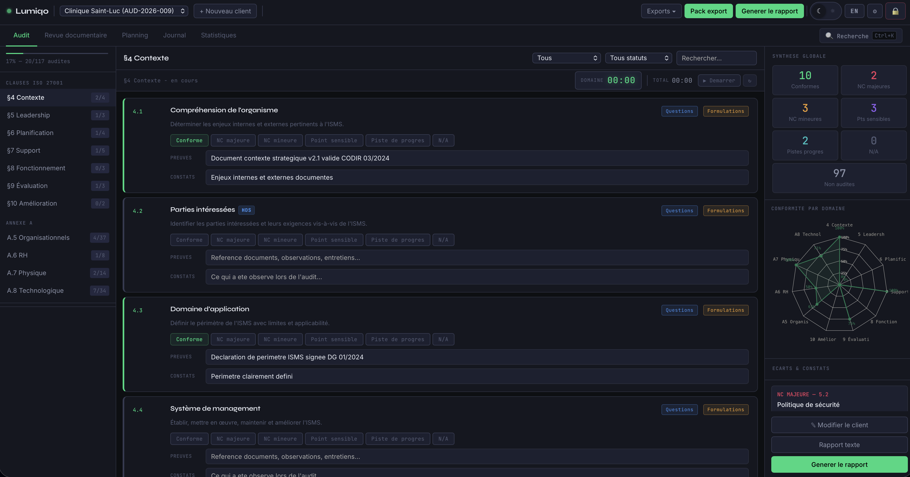
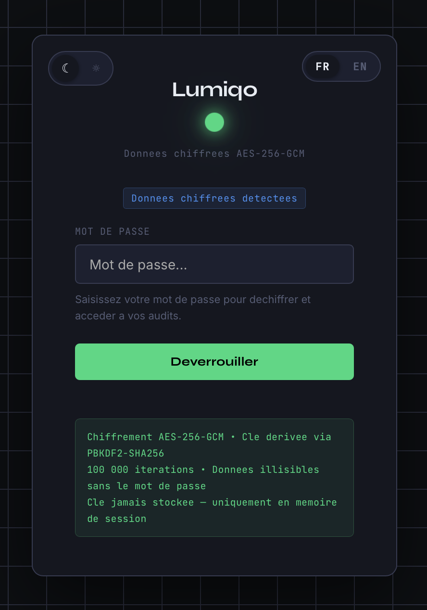
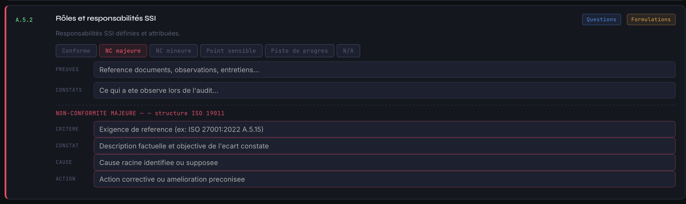
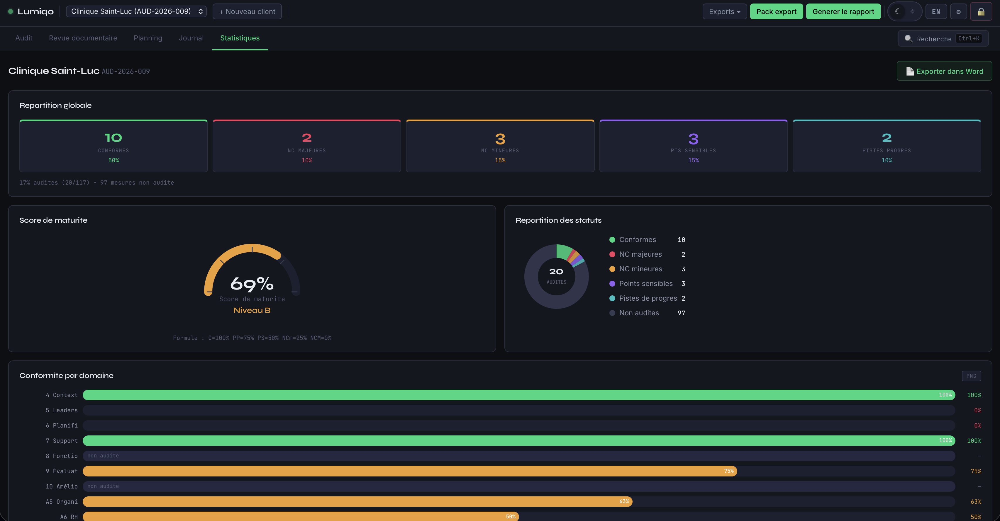
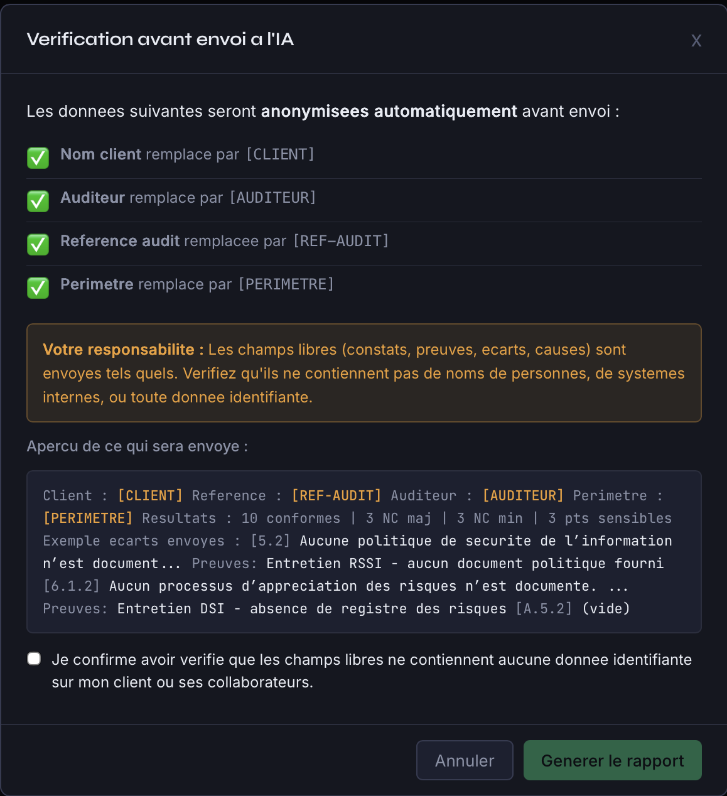
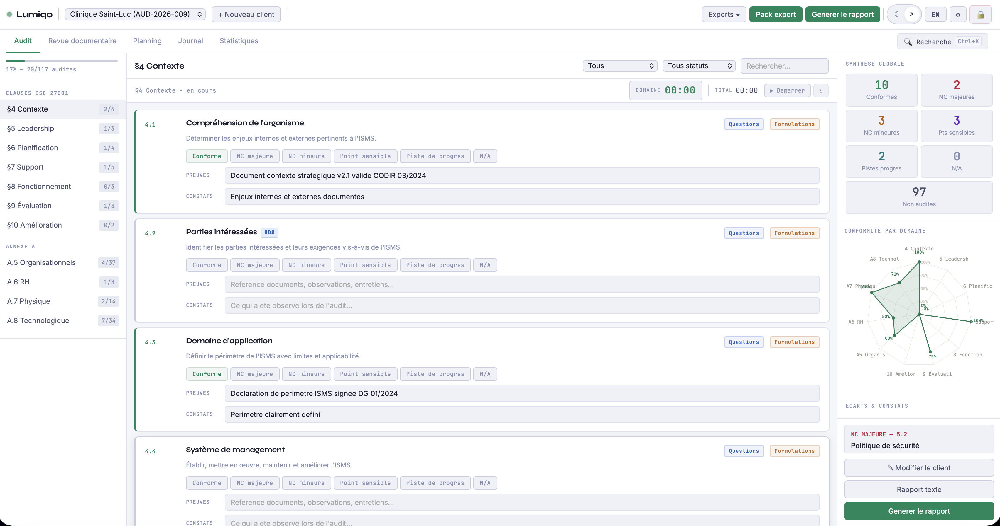
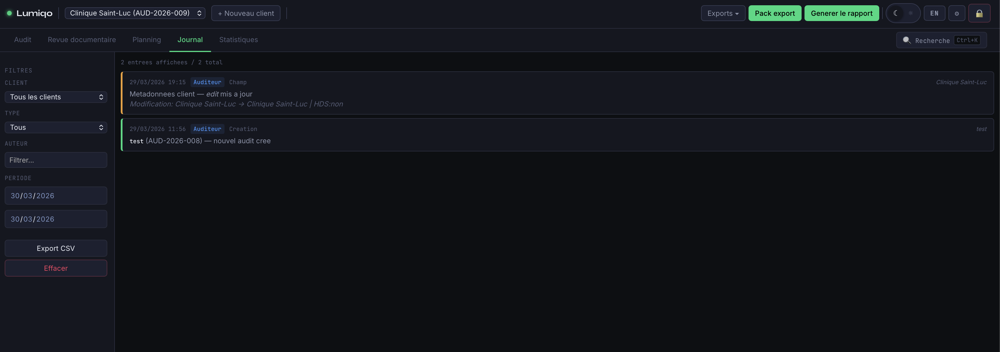

# Lumiqo

**Outil d'audit ISO 27001:2022 + HDS — standalone, chiffré, bilingue FR/EN**

Un fichier HTML autonome complet pour conduire des audits de systèmes de management de la sécurité de l'information (SMSI) selon la norme ISO 27001:2022, avec support du référentiel HDS (Hébergeur de Données de Santé).



---

## Aperçu

<table>
  <tr>
    <td align="center">
      <br/>
      <sub>Connexion chiffrée AES-256</sub>
    </td>
    <td align="center">
      <br/>
      <sub>Audit des 117 mesures ISO 27001</sub>
    </td>
  </tr>
  <tr>
    <td align="center">
      <br/>
      <sub>Statistiques et radar de conformité</sub>
    </td>
    <td align="center">
      <br/>
      <sub>Rapport Word professionnel (9 sections)</sub>
    </td>
  </tr>
  <tr>
    <td align="center">
      <br/>
      <sub>Thème clair</sub>
    </td>
    <td align="center">
      <br/>
      <sub>Journal de traçabilité horodaté</sub>
    </td>
  </tr>
</table>

---

## Fonctionnalités

- **117 mesures ISO 27001:2022** (§4-10 + Annexe A complète) avec questions d'entretien et formulations types
- **Support HDS** — filtrage et marquage des mesures applicables aux hébergeurs de données de santé
- **Chiffrement AES-256-GCM** — toutes les données sont chiffrées localement, jamais transmises
- **Multi-clients** — gérez plusieurs audits simultanément
- **Rapport Word** — génération d'un rapport professionnel complet (9 sections, structure ISO 19011)
- **Statistiques visuelles** — radar, donut, barres, heatmap, jauge de maturité
- **Journal d'audit** — traçabilité horodatée de toutes les modifications
- **Recherche globale** — Ctrl+K pour rechercher dans tous les audits
- **Planning d'audit** — génération automatique de plannings journaliers
- **Revue documentaire** — checklist de 34 documents avec alertes automatiques
- **Génération IA** — rapport narratif via API Anthropic (optionnel, avec anonymisation)
- **Bilingue FR/EN** — interface et contenu entièrement traduits
- **Thème clair/sombre** — switch en un clic, persisté entre les sessions
- **Export** — Word, CSV, JSON chiffré, pack export complet

---

## Utilisation

### Prérequis

Le chiffrement AES-256-GCM requiert un contexte sécurisé (`https://` ou `localhost`).

| Navigateur | Ouverture directe (`file://`) | Via serveur local |
|------------|:---:|:---:|
| Firefox | ✅ | ✅ |
| Safari | ✅ | ✅ |
| Chrome / Edge | ❌ | ✅ |

### Lancement rapide

**Option 1 — Firefox ou Safari**
Ouvrez simplement `lumiqo.html` en double-cliquant.

**Option 3 — Directement en ligne (GitHub Pages)**
Aucune installation requise :
```
https://chtitus.github.io/lumiqo/lumiqo.html
```

**Option 2 — Serveur local (tous navigateurs)**
```bash
# Avec Node.js
npx serve .

# Avec Python
python3 -m http.server 8080
```
Puis ouvrez `http://localhost:3000/lumiqo.html`

### Premier démarrage

1. Définissez un mot de passe — il chiffre toutes vos données (AES-256-GCM, PBKDF2-SHA256, 100 000 itérations)
2. Créez un client via **+ Nouveau client**
3. Sélectionnez un domaine dans la barre latérale et commencez l'audit

> **Important** : le mot de passe n'est jamais stocké. Sans lui, les données sont irrécupérables. Conservez-le précieusement.

---

## Sécurité

- Chiffrement **AES-256-GCM** via Web Crypto API
- Clé dérivée via **PBKDF2-SHA256** (100 000 itérations)
- **Zéro transmission réseau** — tout reste dans votre navigateur
- Clé jamais stockée — uniquement en mémoire de session
- Mode confidentiel pour les clients HDS — désactive la génération IA
- Anonymisation automatique avant tout envoi à l'API Anthropic

---

## Structure du projet

```
lumiqo.html   # Fichier unique autonome (~600 KB)
README.md                 # Ce fichier
LICENSE                   # Licence MIT
CONTRIBUTING.md           # Guide de contribution
screenshots/              # Captures d'écran
  ├── login.png
  ├── interface-dark.png
  ├── interface-light.png
  ├── audit.png
  ├── stats.png
  ├── rapport-word.png
  └── journal.png
```

---

## Génération IA (optionnel)

Pour utiliser la génération de rapport par IA :
1. Obtenez une clé API sur [console.anthropic.com](https://console.anthropic.com)
2. Renseignez-la dans **Paramètres**
3. Les données identifiantes sont anonymisées automatiquement avant envoi
4. Le mode confidentiel bloque cette fonctionnalité pour les clients HDS

---

## Référentiels couverts

- **ISO/IEC 27001:2022** — Exigences SMSI (117 mesures)
- **ISO/IEC 27002:2022** — Bonnes pratiques
- **ISO 19011:2018** — Structure des constats d'audit
- **HDS** — Référentiel hébergeur de données de santé (ANS)
- **RGPD** — Intégration des exigences de protection des données

---

## Contribution

Les contributions sont les bienvenues :
- 🐛 Signaler un bug via les [Issues](https://github.com/chtitus/lumiqo/issues)
- 💡 Proposer une fonctionnalité via les [Issues](https://github.com/chtitus/lumiqo/issues)
- 🔧 Soumettre une amélioration via une [Pull Request](https://github.com/chtitus/lumiqo/pulls)

Consultez le guide [CONTRIBUTING.md](CONTRIBUTING.md) avant de contribuer.

---

## Licence

MIT License — voir le fichier [LICENSE](LICENSE) pour les détails.

---

## Avertissement

Cet outil est fourni à titre indicatif. Les résultats d'audit générés ne constituent pas une certification officielle ISO 27001 ou HDS. Seul un organisme de certification accrédité peut délivrer une certification.
